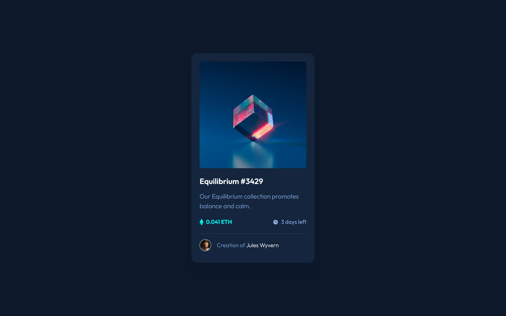

# Frontend Mentor - NFT preview card component solution

This is a solution to the [NFT preview card component challenge on Frontend Mentor](https://www.frontendmentor.io/challenges/nft-preview-card-component-SbdUL_w0U). Frontend Mentor challenges help you improve your coding skills by building realistic projects. 

## Table of contents

- [Overview](#overview)
  - [The challenge](#the-challenge)
  - [Screenshot](#screenshot)
  - [Links](#links)
- [My process](#my-process)
  - [Built with](#built-with)
  - [What I learned](#what-i-learned)
  - [Useful resources](#useful-resources)

## Overview

### The challenge

Users should be able to:

- View the optimal layout depending on their device's screen size
- See hover states for interactive elements

### Screenshot

### Links

- Solution URL: [Solution](https://www.frontendmentor.io/solutions/nft-preview-card-component-sass-and-webpack-5-489uXTBKcT)
- Live Site URL: [Live Demo](https://cyruskabir.github.io/nft-preview-card/build)

## My process

### Built with

- Semantic HTML5 markup
- CSS custom properties
- Flexbox
- CSS Grid
- Sass

### What I learned
I learned a lot about some sass featrues like color functions and loops. 

also I learned a lot about webpack and best practices on webpack configurations. it was a new concept for me (module bundlers) and I learned a lot at first with this little fem challenge about webapck. also I used autoprefixer which it was new too.

### Useful resources
for webpack, docuemnt itself was so helpful but i used webpack book on this link
[Webpack Book](https://survivejs.com/webpack/introduction/)
